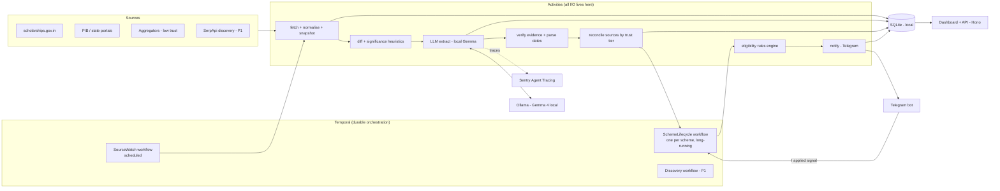

# Scheme Sentinel — Project Details (Technical Specification)

> A durable, local-first, open-model agent that watches Indian scholarship and benefit sources for **one real student**, matches schemes against his profile, tracks each one from "announced" to "money received", and only alerts him when it can point to a source.
>
> Built for the **Hacktoberfest 2026 Weekend Challenge: Build for a Friend** (DEV × MLH × DigitalOcean).
> Working title: *Scheme Sentinel* (rename freely).

---

## 0. How to use this document

This file is the single source of truth for building the project, written so it can be handed to an AI coding agent ("vibe coding") and also read by a human.

**Recommended workflow**

1. Put this file in the repo root. Copy section 1.1 (*Hard rules*) into your agent's instruction file (`AGENTS.md`, `CLAUDE.md`, `.github/copilot-instructions.md`, or equivalent).
2. Build **one milestone at a time** (section 22). Each milestone has acceptance criteria and a starter prompt. Do not skip ahead.
3. After each milestone: run tests, commit, and keep the agent session logs (needed for the *Entire* category and the optional DevRelay embed).
4. Anything marked `TODO(verify)` is a claim about a third-party API, tier, or limit that was **not** confirmed while writing this spec. Check the current docs before relying on it.
5. Anything marked `TODO(after-build)` must be updated with real numbers, links, and quotes once the project works.

## 1. Context and constraints

| Item | Value |
|---|---|
| Challenge | Hacktoberfest Weekend Challenge: *Build for a Friend* |
| Prompt | Open-source AI at the core; solve a real problem for one real person |
| Submission | A post on DEV using the official template (the README mirrors its sections) |
| Deadline | **Mon 5 Oct 2026, 12:29 PM IST** (06:59 UTC). Aim to submit Sunday evening |
| Judging | Writing quality (heaviest), relevance to prompt, creativity, technical execution, optional partner tech |
| Budget | No paid keys and nothing that needs a card up front |
| Team | Solo, vibe-coded |

### 1.1 Hard rules for the coding agent

1. **Do not invent API signatures.** For Mastra, Temporal, Sentry, Ollama, and SerpApi, read the installed package types or current docs. If unsure, write a minimal spike and run it.
2. **Temporal workflow code must be deterministic.** No network, no filesystem, no LLM calls, no randomness, no direct clock reads. Use Temporal's `sleep`, `condition`, and `workflowInfo()`. Workflows import activities through `proxyActivities` with `import type` only.
3. **The LLM never decides eligibility or deadlines on its own.** It extracts facts with evidence. Deterministic code verifies the evidence, parses dates, and applies rules.
4. **No source, no alert.** Every alert must carry `sourceUrl`, an exact `quote`, and a `trustTier`. Otherwise it is not sent.
5. **Never automate login, OTP, face-authentication, or form submission** on any government portal. The agent observes public pages and reminds. A human applies.
6. **No secrets or personal data in git.** `.env` and `data/profile.yaml` are gitignored. Tests, fixtures, screenshots, and traces for publication use a **synthetic** profile.
7. **Tests before wiring** for pure modules (eligibility, deadline parsing, reminder planning, diffing, evidence verification).
8. **Stay in scope.** Finish P0 (section 5) before touching P1 or P2.
9. **Time and dates:** timezone `Asia/Kolkata`; store dates as ISO `YYYY-MM-DD`; parse Indian `DD-MM-YYYY` and `DD/MM/YYYY` as day-first, never month-first.
10. **Small commits** with meaningful messages. Never rewrite history after sessions are recorded.

---

## 2. Problem

Government and institutional scholarships in India are valuable, but families routinely miss them. The pain is not "finding a list of schemes"; it is:

- **Fragmentation.** Central schemes sit on the National Scholarship Portal (NSP, run by NIC). State schemes sit on separate state portals. Notices and corrigenda appear as PIB releases or PDFs.
- **Moving deadlines.** Dates are extended, revised, or differ by scheme and by state. Aggregator websites often disagree with each other and with the official portal.
- **Multi-stage processes.** Applying is only the first stage. Many schemes also have institute verification, district/state verification, and disbursement, each with its own deadline and each a place where an application can silently stall.
- **Document readiness.** Certificates (income, category, domicile, bonafide, marksheets, bank details) must be valid and consistent. Problems found late cost a year.
- **Language and time.** Information is mostly English, scattered, and checked irregularly.

**Context at time of writing (verify on the official portal before quoting):** NSP opened for 2026-27 on 1 June 2026, and most central scholarships list **31 October 2026** as the last date, with some scheme-specific dates earlier and some already extended.
`TODO(after-build): re-verify these dates from scholarships.gov.in and cite the page you used.`

## 3. Goals, non-goals, principles

### 3.1 Goals

- G1. Keep one student continuously informed of scholarships he is **likely eligible** for, with correct deadlines and sources.
- G2. Track each scheme through its **full lifecycle**, not just the application date.
- G3. Run **locally** with an **open-weight model**, so his personal data never needs to leave his machine.
- G4. Be **durable**: survive crashes, restarts, flaky government sites, and long waits without losing state.
- G5. Be **measurable**: publish accuracy, latency, cost, and efficiency numbers.
- G6. Be **honest**: surface uncertainty, conflicts between sources, and what the system could not verify.

### 3.2 Non-goals

- Not an official service and not affiliated with any government body.
- Not a general scholarship search engine for all of India. It covers a **hand-picked set of 5–8 schemes** relevant to one student.
- Does not fill or submit applications. Does not store Aadhaar numbers, passwords, or OTPs.
- Does not guarantee eligibility or deadlines. Always says "verify on the official portal."
- No mobile app, no multi-user accounts, no payments.

### 3.3 Design principles

1. **Evidence over eloquence.** A boring alert with a source beats a fluent one without.
2. **Tri-state eligibility.** `ELIGIBLE`, `NOT_ELIGIBLE`, `UNKNOWN` (with the missing fields named). Never coerce unknown to yes/no.
3. **Cheap first, model last.** Hash and diff before any LLM call. Heuristics before classifier. Local model before anything else.
4. **Official beats aggregator.** Source trust tiers decide who wins a conflict, and conflicts are shown to the user.
5. **Human in the loop** for every irreversible step.
6. **Everything replayable.** Snapshots, extractions, and alerts are stored so any alert can be traced back to the page version that caused it.

---

## 4. Users and user stories

**Primary user:** the friend (`[[FRIEND_NAME]]`, `[[STATE]]`, `[[COURSE]]`, year `[[YEAR]]`). `TODO(after-build): fill in with consent; anonymise sensitive attributes (category, income) in the public post.`

**Secondary user:** the builder (you), who seeds the scheme registry, reviews flagged extractions, and runs evals.

| ID | Story | Tier |
|---|---|---|
| U1 | As the student, I see which watched schemes I am eligible for, not eligible for, or unknown, with reasons. | P0 |
| U2 | I get a Telegram message when a watched scheme's deadline, status, or criteria changes, with a link and the exact sentence that changed. | P0 |
| U3 | I get reminders at T-30/14/7/3/1 days before each deadline, in Hindi or English. | P0 |
| U4 | I see which documents each scheme needs and which of mine are missing or expiring. | P0 |
| U5 | I mark "I applied" and the system keeps tracking verification and payout stages. | P0 |
| U6 | When sources disagree about a date, I am told, and pointed to the official source. | P0 |
| U7 | I can upload a photo of a certificate and get issue-date and name-mismatch checks locally. | P1 |
| U8 | I can ask the bot "what's left for me this week?" and get a grounded answer. | P1 |
| U9 | The system discovers new announcements outside my fixed source list. | P1 |
| U10 | I get a weekly digest. | P2 |
| U11 | I receive reminders as a voice note. | P2 |

---

## 5. Scope tiers

**P0 (must ship, target Saturday night)**
Profile + eligibility engine · source registry + fetch + normalise + diff · evidence-required LLM extraction with verifier · Temporal lifecycle and watch workflows with durable reminders · Telegram alerts (EN/HI) · document checklist · SQLite store · Sentry/Mastra tracing · minimal dashboard · gold-set eval · kill-and-resume demo.

**P1 (if time permits, Sunday morning)**
Certificate image checks (Gemma multimodal) · Telegram Q&A agent (read-only tools) · SerpApi discovery workflow · second-model comparison (Backboard or a second Ollama model).

**P2 (stretch, only if everything else is done)**
Weekly digest · voice reminders (ElevenLabs) · Mastra Studio walkthrough GIF.

---

## 6. System architecture



### 6.1 Data flow in one paragraph

A Temporal **Schedule** triggers `sourceWatchWorkflow(sourceId)`. It runs activities: fetch the page politely, normalise to stable text, hash it, and compare to the last snapshot. If nothing material changed, it stops (no LLM call). If something changed, a heuristic filter decides whether it is *material* (dates, numbers, "extended", "revised", "corrigendum", "last date"). Material changes go to the local model for **evidence-required extraction**; deterministic code verifies each evidence quote exists in the page text and re-parses dates itself. Verified facts are **reconciled** against other sources by trust tier, then **signalled** to the matching `schemeLifecycleWorkflow`, which re-evaluates eligibility, re-plans reminders, and sends an alert if (and only if) the change is verified and relevant.

### 6.2 Component responsibilities

| Component | Responsibility | Must not |
|---|---|---|
| Temporal workflows | State, timers, retries, signals, queries | Do I/O, call the LLM, read the clock directly |
| Temporal activities | All I/O: HTTP, SQLite, Ollama, Telegram, SerpApi | Hold long-lived state |
| Rules engine (`src/rules`) | Eligibility, deadline math, reminder planning | Call anything external |
| LLM layer (`src/llm`) | Prompts, structured output, evidence verification | Decide outcomes |
| Mastra (`src/agent`) | Agent definitions, tool interfaces, tracing export | Replace Temporal as orchestrator |
| Store (`src/store`) | SQLite persistence | Contain business logic |
| Notify (`src/notify`) | Telegram I/O, message templates | Send without evidence |
| API/dashboard | Read-mostly view for the builder and friend | Mutate lifecycle state except via signals |

---

## 7. Tech stack

| Layer | Choice | Notes |
|---|---|---|
| Language/runtime | TypeScript on Node.js **22.13+** | Required by the Mastra Sentry exporter (it uses `@sentry/node`). |
| Package manager | pnpm | Any works. |
| Local model | **Gemma 4** (E4B recommended; E2B for low RAM) via **Ollama** | `TODO(verify)`: exact Ollama tag, quantisation, and RAM needs; run `ollama list` and test. Gemma 4 is multimodal and multilingual (140+ languages). |
| Agent framework | **Mastra** (`@mastra/core`, `@mastra/observability`, `@mastra/sentry`) | `TODO(verify)`: current API names. Mastra Studio runs locally for dev. |
| Orchestration | **Temporal**, TypeScript SDK (`@temporalio/client`, `worker`, `workflow`, `activity`) | Local dev server: `temporal server start-dev` (UI on `localhost:8233`). `TODO(verify)`. |
| Observability | **Sentry Agent Tracing** via the Mastra exporter | `TODO(verify)`: free-plan availability for agent tracing; keep `tracesSampleRate > 0`. |
| Storage | SQLite via `better-sqlite3` | Local only. No hosted DB needed. |
| Validation | `zod` | Single source of truth for schemas. |
| HTML to text | `cheerio` + `@mozilla/readability` (+ `jsdom`) | Strip nav/boilerplate/volatile elements. |
| Diff | `diff` package | Sentence/line level. |
| Dates | custom day-first parser, optionally `chrono-node` | Test with `31st October 2026`, `31-10-2026`, `31/10/2026`. |
| robots.txt | `robots-parser` | Honour it. |
| PDF text | `pdf-parse` or `pdfjs-dist` | Text PDFs only; OCR is out of scope. |
| Server | `hono` + `@hono/node-server` | Static dashboard, no frontend build step. |
| Notifications | Telegram Bot API over `fetch` | Free; no card. Create the bot with @BotFather. |
| Tests | `vitest` | Plus Temporal's test environment for workflow tests. |
| Dev runner | `tsx` | |
| Discovery (P1) | SerpApi | `TODO(verify)`: free-tier search quota. |
| Model comparison (P1) | Backboard or a second Ollama model | `TODO(verify)`: credits claimed at hacktoberfest.com/my. |

---

## 8. Repository layout

```
scheme-sentinel/
├── README.md
├── Project-Details.md
├── AGENTS.md                      # copy of section 1.1 for coding agents
├── package.json
├── tsconfig.json
├── .env.example
├── .gitignore                     # .env, data/profile.yaml, data/*.db, data/raw/, data/private/
├── data/
│   ├── sources.yaml               # watched sources + trust tiers
│   ├── schemes.seed.yaml          # hand-curated scheme registry (5–8 schemes)
│   ├── profile.example.yaml       # synthetic profile (committed)
│   ├── profile.yaml               # REAL profile (gitignored)
│   ├── fixtures/                  # saved HTML/PDF for deterministic demos + tests
│   │   ├── <source>/<date>-before.html
│   │   └── <source>/<date>-after.html
│   └── gold/                      # hand-labelled extraction truth for evals
├── src/
│   ├── config.ts                  # env parsing (zod)
│   ├── domain/                    # zod schemas + types (profile, scheme, facts, alert...)
│   ├── rules/
│   │   ├── eligibility.ts         # tri-state engine
│   │   ├── deadlines.ts           # parsing, end-of-day semantics, IST helpers
│   │   └── reminders.ts           # reminder planning (pure)
│   ├── sources/
│   │   ├── registry.ts            # load sources.yaml
│   │   ├── fetcher.ts             # polite HTTP, robots, ETag, fixture mode
│   │   ├── normalize.ts           # html/pdf -> stable text
│   │   ├── diff.ts                # snapshot diff + significance heuristics
│   │   └── reconcile.ts           # trust-tier conflict resolution
│   ├── llm/
│   │   ├── ollama.ts              # client (native API, JSON-schema `format`)
│   │   ├── prompts/               # versioned prompt files
│   │   ├── extract.ts             # multi-pass extraction
│   │   └── verify.ts              # evidence + date verification
│   ├── agent/
│   │   ├── mastra.ts              # Mastra instance + Sentry exporter
│   │   ├── agents/                # extractor, explainer, documentReader, qa
│   │   └── tools/                 # typed read-only tools
│   ├── temporal/
│   │   ├── workflows/             # sourceWatch, schemeLifecycle, discovery
│   │   ├── activities/            # fetch, diff, extract, verify, reconcile, notify...
│   │   ├── worker.ts
│   │   ├── client.ts              # start/signal/query helpers
│   │   └── schedules.ts           # create Temporal Schedules
│   ├── documents/                 # checklist + image checks (P1)
│   ├── notify/
│   │   ├── telegram.ts            # send + long-poll commands + inline buttons
│   │   └── templates.ts           # EN/HI slot-filled templates
│   ├── store/                     # schema.sql + repositories
│   ├── api/                       # Hono routes
│   ├── observability/             # metrics + redaction helpers
│   └── eval/                      # runner, scorers, report generator
├── public/                        # static dashboard (index.html, app.js, styles.css)
├── scripts/
│   ├── seed.ts                    # load registry + profile
│   ├── demo-kill-resume.ts
│   ├── demo-replay.ts             # before/after fixture replay
│   └── make-report.ts             # eval -> markdown tables for the post
└── tests/                         # vitest: rules, diff, verify, reminders, workflows
```

---

## 9. Domain model

### 9.1 Student profile (`src/domain/profile.ts`)

Stored in `data/profile.yaml` (gitignored). **Booleans and bands, not identifiers**: never store Aadhaar, bank account numbers, or passwords.

```ts
export const StudentProfile = z.object({
  id: z.string(),                          // e.g. "friend-1"
  displayName: z.string(),                 // used in messages
  fullNameOnDocuments: z.string(),         // for name-mismatch checks (local only)
  language: z.enum(['en', 'hi']).default('en'),
  homeState: z.string(),                   // domicile state
  studyState: z.string(),
  courseLevel: z.enum(['class9_10','class11_12','diploma','ug','pg','phd']),
  courseName: z.string(),
  yearOfStudy: z.number().int().min(1).max(8),
  institutionType: z.enum(['government','aided','private','central']).optional(),
  category: z.enum(['general','obc','sc','st','ews']).optional(),  // optional + sensitive
  minority: z.boolean().optional(),                                  // optional + sensitive
  gender: z.enum(['female','male','other']).optional(),
  hasDisability: z.boolean().optional(),
  annualFamilyIncomeInr: z.number().int().nonnegative().optional(),  // optional + sensitive
  lastExamPercent: z.number().min(0).max(100).optional(),
  bankAccountAadhaarSeeded: z.boolean().optional(),                  // boolean only
  isRenewal: z.record(z.string(), z.boolean()).default({}),          // schemeId -> renewal?
  telegramChatId: z.string().optional(),
});
```

Missing optional fields are legitimate and lead to `UNKNOWN` eligibility, not guesses.

### 9.2 Scheme registry (`data/schemes.seed.yaml`)

Hand-curated from **official** pages. Each entry is the baseline truth the watcher compares against.

```yaml
# EXAMPLE STRUCTURE ONLY. Replace every value with data verified from the official page.
- id: example-central-scheme
  name: "<official scheme name>"
  authority: "<ministry / department>"
  level: central            # central | state
  portal: nsp               # nsp | state-portal | other
  sourceIds: [nsp-home, nsp-scheme-page]   # see sources.yaml
  academicYear: "2026-27"
  criteria:                 # each criterion keeps its evidence
    courseLevels: { value: [ug, pg], evidence: { quote: "<exact sentence>", sourceUrl: "<url>" } }
    maxFamilyIncomeInr: { value: null, evidence: null }   # null = not verified yet
  documentsRequired:
    - { docType: income_certificate, evidence: { quote: "<...>", sourceUrl: "<url>" } }
  deadlines:
    freshApplication: { date: "YYYY-MM-DD", evidence: { quote: "<...>", sourceUrl: "<url>" } }
    renewal: null
    instituteVerification: null
    stateVerification: null
  lastVerifiedBy: "human"
  lastVerifiedAt: "YYYY-MM-DD"
```

### 9.3 Extracted facts (`src/domain/facts.ts`)

Every fact is wrapped with evidence. A fact without evidence is invalid.

```ts
const Evidence = z.object({
  quote: z.string().min(8),          // MUST be a verbatim substring of the normalised page text
  sourceUrl: z.string().url(),
  snapshotId: z.string(),
});
const Sourced = <T extends z.ZodTypeAny>(t: T) => z.object({ value: t, evidence: Evidence });
const IsoDate = z.string().regex(/^\d{4}-\d{2}-\d{2}$/);

export const DeadlineFacts = z.object({
  status: Sourced(z.enum(['upcoming','open','closed','extended','unknown'])).nullable(),
  freshApplication: Sourced(IsoDate).nullable(),
  renewal: Sourced(IsoDate).nullable(),
  instituteVerification: Sourced(IsoDate).nullable(),
  stateVerification: Sourced(IsoDate).nullable(),
  noticeType: Sourced(z.enum(['extension','revision','new_scheme','corrigendum','none'])).nullable(),
});

export const CriteriaFacts = z.object({
  courseLevels: Sourced(z.array(z.string())).nullable(),
  categories: Sourced(z.array(z.string())).nullable(),
  states: Sourced(z.array(z.string())).nullable(),
  maxFamilyIncomeInr: Sourced(z.number()).nullable(),
  minPercent: Sourced(z.number()).nullable(),
  genderRestriction: Sourced(z.enum(['female_only','none'])).nullable(),
  disabilityRequired: Sourced(z.boolean()).nullable(),
  otherConditions: z.array(Sourced(z.string())).default([]),   // anything not parseable -> human review
});

export const DocumentFacts = z.object({
  documentsRequired: z.array(Sourced(z.string())).default([]),
});
```

### 9.4 SQLite schema (`src/store/schema.sql`)

```sql
CREATE TABLE source (
  id TEXT PRIMARY KEY, url TEXT NOT NULL, kind TEXT NOT NULL,      -- html|pdf|rss
  trust_tier INTEGER NOT NULL CHECK (trust_tier IN (1,2,3)),       -- 1 official, 2 reputable aggregator, 3 other
  poll_minutes INTEGER NOT NULL, last_etag TEXT, last_checked_at TEXT
);
CREATE TABLE snapshot (
  id TEXT PRIMARY KEY, source_id TEXT NOT NULL REFERENCES source(id),
  fetched_at TEXT NOT NULL, content_hash TEXT NOT NULL,
  normalized_text TEXT NOT NULL, raw_path TEXT, http_status INTEGER, fixture INTEGER DEFAULT 0
);
CREATE INDEX idx_snapshot_source_time ON snapshot(source_id, fetched_at DESC);
CREATE TABLE change (
  id TEXT PRIMARY KEY, source_id TEXT NOT NULL, from_snapshot TEXT, to_snapshot TEXT NOT NULL,
  diff_json TEXT NOT NULL, material INTEGER NOT NULL, material_reasons TEXT, created_at TEXT NOT NULL
);
CREATE TABLE extraction (
  id TEXT PRIMARY KEY, snapshot_id TEXT NOT NULL REFERENCES snapshot(id),
  scheme_id TEXT, model TEXT NOT NULL, prompt_version TEXT NOT NULL, pass TEXT NOT NULL,   -- deadlines|criteria|documents
  output_json TEXT NOT NULL, verified_json TEXT NOT NULL, dropped_fields TEXT,
  latency_ms INTEGER, input_tokens INTEGER, output_tokens INTEGER, created_at TEXT NOT NULL
);
CREATE TABLE scheme_state (
  scheme_id TEXT PRIMARY KEY, stage TEXT NOT NULL,            -- discovered|eligible|docs_ready|applied|institute_verified|state_verified|disbursed|closed_missed|not_eligible
  eligibility TEXT NOT NULL, eligibility_reasons TEXT,        -- ELIGIBLE|NOT_ELIGIBLE|UNKNOWN
  deadlines_json TEXT, conflicts_json TEXT, updated_at TEXT NOT NULL
);
CREATE TABLE alert (
  id TEXT PRIMARY KEY, scheme_id TEXT, type TEXT NOT NULL,    -- reminder|deadline_changed|status_changed|criteria_changed|conflict|doc_issue|discovery
  severity TEXT NOT NULL, dedupe_key TEXT NOT NULL UNIQUE,
  source_url TEXT NOT NULL, quote TEXT NOT NULL, trust_tier INTEGER NOT NULL,
  text_en TEXT NOT NULL, text_hi TEXT, channel TEXT NOT NULL, sent_at TEXT, acked_at TEXT
);
CREATE TABLE document (
  id TEXT PRIMARY KEY, doc_type TEXT NOT NULL, status TEXT NOT NULL,   -- missing|have|expiring|expired|mismatch
  issued_on TEXT, valid_until TEXT, local_path TEXT, check_json TEXT, updated_at TEXT NOT NULL
);
CREATE TABLE run_metric (
  id TEXT PRIMARY KEY, workflow_id TEXT, kind TEXT NOT NULL,           -- watch|extract|notify
  started_at TEXT, duration_ms INTEGER, llm_calls INTEGER, skipped_by_diff INTEGER,
  input_tokens INTEGER, output_tokens INTEGER, cost_inr REAL DEFAULT 0
);
```

`alert.dedupe_key` makes alerts idempotent under Temporal retries: e.g. `reminder:<schemeId>:<deadline>:T-7`.

---

## 10. Source layer

### 10.1 Source registry (`data/sources.yaml`)

```yaml
- id: nsp-home
  url: "https://scholarships.gov.in/"
  kind: html
  trustTier: 1
  pollMinutes: 360
- id: pib-education        # example: a PIB listing page or ministry notice page you verify
  url: "<verified URL>"
  kind: html
  trustTier: 1
  pollMinutes: 360
- id: aggregator-nsp       # example aggregator: useful for discovery, NEVER authoritative
  url: "<verified URL>"
  kind: html
  trustTier: 3
  pollMinutes: 720
```

Trust tiers: **1** = official (`*.gov.in`, `*.nic.in`, PIB, institution notices) · **2** = established aggregator with citations to official notices · **3** = everything else.

### 10.2 Polite fetching (`fetcher.ts`)

- Identify yourself: `User-Agent: SchemeSentinel/0.1 (student project; contact: <email>)`.
- Fetch and honour `robots.txt` (cache per host). If disallowed → skip and log.
- Per-host rate limit (e.g. ≥ 5 s between requests); polling intervals are hours, not seconds.
- Use `ETag` / `If-Modified-Since` where supported.
- Timeouts (15 s), max body size (5 MB), follow ≤ 3 redirects, `https` only.
- Government sites can be slow, JS-heavy, or block bots. Retry with backoff via Temporal; if a source is persistently unreachable, raise a **source-health** alert to the builder (not the student).
- **Fixture mode** (`FIXTURE_MODE=1`): read from `data/fixtures/<sourceId>/` instead of the network. Used for tests and for the deterministic replay demo. **Anything produced in fixture mode must be labelled "simulated" in the post.**

### 10.3 Normalisation (`normalize.ts`)

Goal: the same page content ⇒ the same text, so hashes only change when meaning changes.

1. HTML → remove `script, style, nav, header, footer, aside, form`, cookie banners, visitor counters, "last updated"/clock widgets (configurable CSS selectors per source).
2. Readability extraction → plain text; keep headings, list items, and table rows (render rows as `a | b | c`).
3. Collapse whitespace; normalise unicode (NFKC); strip zero-width chars.
4. Split to sentences/lines with stable ordering.
5. Compute `sha256` of the normalised text.
6. PDFs: extract text; if extracted text is empty (scanned), mark `needs_manual_review` and do **not** call the LLM.

### 10.4 Diff and significance (`diff.ts`)

- Compare the latest two snapshots at sentence level. Output added/removed/changed sentences.
- **Material-change heuristics** (cheap, run before any LLM call). A change is material if any added/removed sentence contains: a date pattern; a number with `₹`/`Rs`/`lakh`/`%`; or keywords (`last date`, `extended`, `extension`, `revised`, `corrigendum`, `notice`, `open`, `closed`, `deadline`, `verification`, `last date to apply`, plus Hindi: `अंतिम तिथि`, `बढ़ाई`, `संशोधित`).
- Immaterial changes (counters, timestamps, re-ordered menus) are stored but short-circuit the workflow.
- Record `skipped_by_diff` in `run_metric`. This is one of the headline numbers for the post.

### 10.5 Reconciliation (`reconcile.ts`)

Given verified facts from multiple sources for the same scheme:

1. Group by field (e.g. `deadlines.freshApplication`).
2. If all sources agree → accept, `confidence = high` if any tier-1 source is included.
3. If sources disagree → **tier-1 wins**; record a `conflict` with all values, tiers, quotes, and URLs; the alert says: *"Official page says X; another site says Y. Verify on the official portal."*
4. If only tier-2/3 sources report a **change** → do **not** update the registry. Emit an `unverified_report` alert type, worded as unconfirmed.
5. Never delete a baseline date because a source went silent.

---

## 11. LLM layer

### 11.1 Runtime

- Ollama running locally, native API `POST http://localhost:11434/api/chat` with `format: <JSON schema>` for schema-constrained output. `TODO(verify)`: structured-output parameter shape for your Ollama version.
- Default model from `OLLAMA_MODEL` (Gemma 4 E4B). `temperature: 0`, fixed `seed`, `num_ctx` large enough for the page (chunk if not).
- No network LLM calls anywhere in P0.

### 11.2 Multi-pass extraction (`extract.ts`)

Small models are more reliable with **small schemas**. Run three independent passes per material change:

| Pass | Schema | Purpose |
|---|---|---|
| A: `deadlines` | `DeadlineFacts` | dates, status, notice type |
| B: `criteria` | `CriteriaFacts` | eligibility conditions |
| C: `documents` | `DocumentFacts` | required documents |

Long pages are chunked (≈ 3–4k tokens with overlap), each chunk extracted separately, then merged: prefer the fact with the clearest evidence; on disagreement keep both and mark for review.

### 11.3 Prompt contract (`src/llm/prompts/extract.v1.md`)

```
SYSTEM
You extract facts about Indian scholarship schemes from the text provided.
Rules:
1. Use ONLY the text between <page> tags. Never use prior knowledge.
2. For every field you fill, copy the exact supporting sentence from the page into "quote". Do not paraphrase the quote.
3. If the page does not clearly state a field, return null for it. Guessing is a failure.
4. Dates in Indian pages are day-first (31-10-2026 = 31 October 2026). Return ISO YYYY-MM-DD.
5. If you see conflicting statements, return the one stated most recently or most formally and put the other in otherConditions.
6. Return JSON matching the schema. No commentary.

USER
Scheme hint: {{schemeName}}   Academic year: {{academicYear}}   Source URL: {{url}}
<page>
{{chunkText}}
</page>
```

Version prompts (`extract.v1`, `extract.v2`…). Store `prompt_version` with each extraction so evals compare like with like.

### 11.4 Verification (`verify.ts`): the part that makes this not a wrapper

For every `Sourced` fact in the model output:

1. **Quote check.** Normalise both quote and page text (case, whitespace, unicode). The quote must be a substring of the page text (allow a small edit-distance tolerance, e.g. ≤ 3%). If not → **drop the fact** and add it to `dropped_fields` (counts as a *hallucination*).
2. **Date check.** Re-parse the date **from the quote** with the deterministic parser. If the parsed date ≠ the model's ISO value → drop and count a *date mismatch*.
3. **Number check.** For income/percent, find the number in the quote and compare after normalising `lakh`/`lac`/commas.
4. **Enum sanity.** `status = extended` requires an extension keyword in the quote.
5. **Plausibility.** Deadline year within `academicYear ± 1`; dates not in the distant past; verification deadlines ≥ application deadline when both exist.

Only facts that pass all checks reach reconciliation. Keep per-pass counters: `kept`, `dropped_quote`, `dropped_date`, `dropped_other`. These feed the eval report.

### 11.5 Language output

The model is **not** used to write free-form alerts in P0. Alerts are slot-filled from templates (section 16). For Hindi, templates are written once by hand. If you add model-written Hindi (P1 `explainerAgent`), run a **post-check** that every date, number, and URL in the output appears in the input facts; on failure, fall back to the template.

---

## 12. Eligibility engine (`src/rules/eligibility.ts`)

Pure, deterministic, fully unit-tested.

```ts
type Verdict = 'ELIGIBLE' | 'NOT_ELIGIBLE' | 'UNKNOWN';
interface CriterionResult {
  criterion: string;                 // 'maxFamilyIncomeInr'
  verdict: Verdict;
  reason: string;                    // 'Income ₹2.8L is above limit ₹2.5L'
  missingProfileField?: string;      // for UNKNOWN
  evidence?: { quote: string; sourceUrl: string };
}
interface EligibilityResult {
  overall: Verdict;
  results: CriterionResult[];
  unverifiedConditions: string[];    // otherConditions needing a human
}
```

**Aggregation:** any `NOT_ELIGIBLE` ⇒ overall `NOT_ELIGIBLE`; else any `UNKNOWN` (or non-empty `unverifiedConditions`) ⇒ `UNKNOWN`; else `ELIGIBLE`.

**Rules to implement**

- `courseLevels`: profile level ∈ list.
- `categories`: profile category ∈ list (if profile category missing ⇒ `UNKNOWN`).
- `states`: homeState or studyState per the scheme's rule (store which one in the registry).
- `maxFamilyIncomeInr`: profile ≤ limit (boundary inclusive; confirm per scheme wording).
- `minPercent`: lastExamPercent ≥ limit.
- `genderRestriction`, `disabilityRequired`.
- `otherConditions` always surface as "needs your check".

**Test table (minimum):** 20+ cases covering each rule, boundaries, missing fields, and aggregation order. Property: *adding information never turns UNKNOWN into the wrong definite verdict*.

---

## 13. Temporal design

### 13.1 Concepts and naming

| Item | Value |
|---|---|
| Namespace | `default` (dev server) |
| Task queue | `sentinel` |
| Workflow IDs | `watch-<sourceId>`, `scheme-<profileId>-<schemeId>`, `discovery-daily` |
| Time zone | `Asia/Kolkata` for human-facing times (reminders at 09:00 IST) |

### 13.2 `sourceWatchWorkflow(input: { sourceId })`

Triggered by a **Temporal Schedule** (e.g. every `poll_minutes`; use 1–2 minutes for the demo).

```
1. snap   = fetchAndSnapshot(sourceId)            // activity, retried with backoff
2. if snap.unchanged -> record metric (skipped_by_diff=1); return
3. diff   = diffSnapshots(snap.prevId, snap.id)   // activity
4. if !diff.material -> record; return
5. facts  = extractFacts(snap.id)                 // activity: 3 passes + verify
6. rec    = reconcile(facts)                      // activity
7. for each affected schemeId in rec:
      signalWithStart(scheme-<profile>-<schemeId>, 'factsUpdated', rec[schemeId])
8. recordMetrics()
```

**Retry policy for fetch:** initial 5 s, backoff ×2, max interval 5 min, max attempts 6; non-retryable: `RobotsDisallowed`, HTTP 404 on a pinned URL (raise source-health alert instead).
**Timeouts:** fetch `startToCloseTimeout` 60 s; extract `startToCloseTimeout` 5 min with `heartbeat` during chunk loops.

### 13.3 `schemeLifecycleWorkflow(input: { profileId, schemeId })`

Long-running, one per scheme per student. Models the stage machine:

```
discovered -> eligible/unknown/not_eligible -> docs_ready -> applied
           -> institute_verified -> state_verified -> disbursed
           (terminal alternatives: closed_missed, not_eligible)
```

**Signals**

| Signal | Payload | Effect |
|---|---|---|
| `factsUpdated` | reconciled facts | re-evaluate eligibility, update deadlines, re-plan reminders, maybe alert |
| `profileUpdated` | profile diff | re-evaluate eligibility |
| `docsStatusChanged` | doc statuses | recompute `docs_ready` |
| `userConfirmedApplied` | `{ appliedOn }` | move to `applied`; start verification-stage tracking |
| `stageAdvanced` | `{ stage, evidence? }` | manual/verified progression |
| `snooze` | `{ untilIso }` | suppress reminders |

**Queries:** `getState()` returns stage, eligibility, next reminder time, deadlines, conflicts, pending docs.

**Durable timers:** the workflow computes the reminder plan (pure function from `rules/reminders.ts`), then loops:

```ts
// sketch: verify imports/signatures against the installed @temporalio/workflow version
while (!isTerminal(state)) {
  const next = nextReminder(state);                          // pure
  const woke = await condition(() => inbox.length > 0, next ? msUntil(next) : '7 days');
  if (woke) { await handleInbox(); continue; }               // signals processed deterministically
  if (next) await act.sendReminder(buildReminder(state, next));   // activity, idempotent via dedupeKey
  if (workflowInfo().historyLength > 2000) await continueAsNew<typeof schemeLifecycleWorkflow>(snapshot(state));
}
```

**Deadline semantics:** a "last date" of `2026-10-31` means **end of that day in IST (23:59:59)** unless the source says otherwise. Reminder offsets: T-30, T-14, T-7, T-3, T-1 and "today" at 09:00 IST. Past offsets are skipped. On `factsUpdated` with a changed deadline, **re-plan**: cancel obsolete reminders, create the new set, and send one `deadline_changed` alert.

### 13.4 Activities (`src/temporal/activities`)

`fetchAndSnapshot` · `diffSnapshots` · `extractFacts` · `verifyFacts` · `reconcileFacts` · `evaluateEligibility` · `loadProfile` · `saveSchemeState` · `sendAlert` (Telegram + store, idempotent on `dedupeKey`) · `recordMetrics` · `discoverViaSerpApi` (P1) · `checkDocumentImage` (P1).

All activities: typed inputs/outputs from `src/domain`, no hidden global state, errors classified as retryable vs non-retryable (`ApplicationFailure.nonRetryable`).

### 13.5 Idempotency and exactly-once effects

Temporal retries activities, so side effects must be idempotent:

- `sendAlert` computes `dedupe_key`, does `INSERT … ON CONFLICT DO NOTHING`, and only calls Telegram if the insert created a row; mark `sent_at` after a successful send.
- Snapshot inserts keyed by `(source_id, content_hash)`.

### 13.6 Schedules (`schedules.ts`)

Create one schedule per source (interval from `poll_minutes`), overlap policy `SKIP`, plus an optional daily `discoveryWorkflow` (P1). Provide `pnpm schedules:create` and `pnpm schedules:delete`.

### 13.7 Testing workflows

Use Temporal's TypeScript **test environment** with time skipping: assert (a) reminders fire at the right offsets, (b) a `factsUpdated` signal re-plans, (c) `userConfirmedApplied` advances the stage, (d) duplicate signals don't duplicate alerts. `TODO(verify)`: current testing package/API names.

---

## 14. Mastra layer

Mastra is the **agent and tracing** layer; **Temporal remains the orchestrator**. Keep this boundary clear so the project is explainable in the post.

### 14.1 Setup (`src/agent/mastra.ts`)

```ts
// sketch: verify against current Mastra docs
import { Mastra } from '@mastra/core';
import { Observability } from '@mastra/observability';
import { SentryExporter } from '@mastra/sentry';

export const mastra = new Mastra({
  agents: { extractorAgent, explainerAgent, documentReaderAgent, qaAgent },
  observability: new Observability({ /* configs: exporters: [new SentryExporter({ dsn: process.env.SENTRY_DSN })] */ }),
});
```

Requirements noted from the Mastra/Sentry docs: Node ≥ 22.13, a Sentry project DSN, and a non-zero `tracesSampleRate`. `TODO(verify)`: exact option names and whether prompts/outputs are recorded in spans.

**Privacy for traces:** traces can contain prompts and outputs. For any trace you screenshot or publish, run with the **synthetic** profile and public pages only. For the real profile, disable input/output capture or redact before export.

### 14.2 Agents

| Agent | Model | Tools | Used in |
|---|---|---|---|
| `extractorAgent` | Gemma 4 (Ollama) | none (pure function of page text) | `extractFacts` activity |
| `explainerAgent` (P1) | Gemma 4 | none; slot-fills from verified facts | optional message polish |
| `documentReaderAgent` (P1) | Gemma 4 (multimodal) | none | `checkDocumentImage` activity |
| `qaAgent` (P1) | Gemma 4 | read-only tools below | Telegram `/ask` |

### 14.3 Tools (read-only, typed with zod)

`getProfileSummary` (no sensitive raw fields) · `listSchemes` · `getSchemeState(schemeId)` · `getEligibility(schemeId)` · `getChecklist(schemeId)` · `getUpcomingDeadlines(days)` · `searchScholarships(query)` (SerpApi, P1; results are *leads*, never facts).

The Q&A agent must answer **only** from tool outputs and must cite the scheme page URL. If a tool returns nothing, it says so.

### 14.4 Why both Mastra and Temporal

Mastra gives agent definitions, tool contracts, local Studio inspection, and exporter-based tracing. Temporal gives durability, timers, retries, and signals. Using Temporal for control flow and Mastra for the model-facing steps keeps each tool in its lane, and gives the post two clear, honest stories (observability and durability).

---

## 15. Documents module

### 15.1 Checklist (P0)

Document types: `income_certificate`, `category_certificate`, `domicile_certificate`, `bonafide_certificate`, `marksheet_last_exam`, `bank_passbook_or_statement`, `photo`, `disability_certificate`, `other`.

For each scheme the registry lists required document types with evidence. The checklist view joins requirements with the student's `document` rows:

| Status | Meaning |
|---|---|
| `missing` | No record |
| `have` | Present and not known to be expired |
| `expiring` | `valid_until` within 30 days (or issue date older than the scheme's validity window, if verified) |
| `expired` | Past validity |
| `mismatch` | Name/date inconsistent with other documents (P1) |

**Validity windows vary by state and scheme.** Never hard-code "valid for 6 months". Store a validity rule only if the scheme page or state guideline says so, with evidence; otherwise show "check validity requirement."

### 15.2 Image checks (P1, `documentReaderAgent`)

Input: a local photo/scan of a certificate. Output (JSON, schema-constrained): `documentType`, `issuingAuthority?`, `issueDate?`, `nameOnDocument?`, `confidence`.

- Run on **Gemma 4 multimodal locally**; the image never leaves the machine.
- Compare `nameOnDocument` to `fullNameOnDocuments` with normalised token matching (case, punctuation, initials, spelling variants). Flag mismatches for **human** review; never auto-reject.
- Persist only derived fields plus a local file path. Do not log image bytes or OCR text in traces.
- Evaluate on a handful of **synthetic or redacted** samples; do not publish real certificates.

---

## 16. Notifications (Telegram)

### 16.1 Setup

Create a bot via @BotFather → `TELEGRAM_BOT_TOKEN`. Get the student's chat id after he sends `/start` → `TELEGRAM_CHAT_ID`. Use long polling (`getUpdates`) for commands; no public webhook needed.

### 16.2 Commands

| Command | Behaviour |
|---|---|
| `/start` | Register chat id; choose language (EN/HI) |
| `/status` | Table of schemes: stage, eligibility, next deadline |
| `/docs` | Document checklist with gaps |
| `/applied <scheme>` | Signals `userConfirmedApplied` |
| `/snooze <scheme> <days>` | Signals `snooze` |
| `/ask <question>` | P1 Q&A agent (read-only tools) |
| `/help` | Commands and the disclaimer |

Inline buttons on reminders: **✅ I applied**, **⏰ Snooze 3 days**, **🔗 Open official page**. Button callbacks map to workflow signals.

### 16.3 Templates (`templates.ts`): slot-filled, no free generation in P0

```
EN reminder:
⏰ {schemeName}: last date {deadline} ({daysLeft} days left)
Status: {eligibilityLabel} · Docs: {docsReady}/{docsTotal} ready
Source ({trustLabel}): {sourceUrl}
"{quote}"
Dates change. Please verify on the official portal before acting.

HI reminder:
⏰ {schemeName}: अंतिम तिथि {deadline} (अब {daysLeft} दिन बचे)
स्थिति: {eligibilityLabelHi} · दस्तावेज़: {docsTotal} में से {docsReady} तैयार
स्रोत ({trustLabelHi}): {sourceUrl}
कृपया कार्रवाई से पहले आधिकारिक पोर्टल पर तारीख़ ज़रूर जाँच लें।

Deadline changed (EN):
🔔 Update for {schemeName}: last date changed {oldDate} → {newDate}
Source ({trustLabel}): {sourceUrl}
"{quote}"
{conflictNote}
```

Rules: always include `sourceUrl`, `quote`, `trustLabel`, and the "verify on the official portal" line. If `conflicts` exist, append: *"Another source says {otherDate}. The official source takes priority; please verify."* Have a native Hindi speaker (the friend) review the Hindi templates.

---

## 17. API and dashboard

Hono server on `http://localhost:8787`, static files from `public/`. No frontend build step.

| Endpoint | Purpose |
|---|---|
| `GET /api/overview` | Schemes with stage, eligibility, next deadline, conflicts |
| `GET /api/schemes/:id` | Detail: criteria + evidence, deadlines + evidence, checklist, alert history |
| `GET /api/changes` | Recent material changes with diff and linked extraction |
| `GET /api/alerts` | Alert log with source + quote |
| `GET /api/metrics` | Run metrics: checks, skipped-by-diff %, LLM calls, tokens, latency, ₹ cost |
| `GET /api/workflows` | Live workflow states (via Temporal queries) |
| `POST /api/signal/:schemeId` | Send `userConfirmedApplied` / `snooze` / `stageAdvanced` |

**Dashboard views:** (1) *Overview* with a deadline countdown and stage chips; (2) *Scheme detail* showing each criterion with its evidence quote and verdict; (3) *What changed* diff viewer; (4) *Docs*; (5) *Metrics*. For the demo, show the Temporal UI alongside.

---

## 18. Observability and metrics

### 18.1 Tracing (Sentry via Mastra)

Goal: be able to answer "why did the agent say that, how long did it take, and what did it cost?" for any alert.

- Every extraction run produces a trace: page → pass A/B/C → verify → reconcile.
- Record per-call latency and token counts (local model cost = ₹0, but still record compute time).
- Tag traces with `schemeId`, `sourceId`, `promptVersion`, `model`.
- Capture **one real debugging story** for the post (e.g., a hallucinated date caught by the verifier, found via trace, fixed by prompt v2 or schema change). Screenshot the before/after trace.

### 18.2 Metrics table (`run_metric`)

Derived numbers for the post: total checks · % skipped by diff · LLM calls · tokens in/out · p50/p95 extraction latency · hallucination rate (facts dropped by the verifier ÷ facts proposed) · alerts sent · alerts with a tier-1 source.

---

## 19. Evaluation plan

All numbers in the post must come from `pnpm eval` output, not memory.

### 19.1 Extraction gold set (`data/gold/`)

15–20 pages/notices (real saved HTML/PDF text), each hand-labelled:

```json
{
  "id": "gold-007", "fixture": "data/fixtures/<source>/<file>.html", "schemeHint": "...",
  "expected": {
    "deadlines": { "freshApplication": "2026-10-31", "renewal": null, "status": "open" },
    "criteria": { "courseLevels": ["ug","pg"], "maxFamilyIncomeInr": 250000 },
    "documentsRequired": ["income_certificate", "bonafide_certificate"]
  }
}
```

Include hard cases: extended deadlines, two different dates on one page, Hindi/English mixed text, tables, PDF notices, pages with no useful facts (expected: all `null`).

### 19.2 Metrics

| Metric | Definition |
|---|---|
| Date exact-match | predicted ISO == expected (per field) |
| List F1 | set F1 for `courseLevels`, `documentsRequired`, etc. |
| Number match | income/percent equal after normalisation |
| Null correctness | model returns `null` when expected `null` |
| Hallucination rate | fraction of proposed facts whose quote isn't in the page |
| Verifier save rate | wrong facts caught by `verify.ts` ÷ wrong facts proposed |
| Latency | p50/p95 per page (and per pass) |
| Tokens | in/out per page |
| Cost | ₹0 local; compute time recorded |

### 19.3 Model comparison

Run the same gold set through: (1) Gemma 4 E4B (default), (2) a second open model (another Ollama model or via Backboard), (3) optional: a free-tier closed model **only if** a keyless-card free key is available. Report honestly: if a larger or closed model scores higher, say so, and make the open-model case on privacy, cost, offline use, and control. Present before/after for the **verifier** (raw model vs verified output); this is the strongest evidence that the engineering, not the model alone, creates reliability.

### 19.4 Other tests and demos

- **Rules:** table-driven eligibility, deadline parsing, reminder planning (vitest).
- **Diff gating:** feed N snapshots with M real changes; assert the LLM is called ≤ M times.
- **Durability (`demo-kill-resume.ts`):** start a lifecycle workflow with short timers, `kill -9` the worker, restart, assert it completes and sends each reminder exactly once; capture the Temporal event history.
- **Replay (`demo-replay.ts`):** apply a *before→after* fixture pair of a real notice (e.g. an extension) and show the alert produced, labelled **simulated** unless you captured a live change.
- **Live check:** run against real sources for at least one full poll cycle; report what actually happened (even if "no changes").

### 19.5 Report generation

`pnpm eval && pnpm report` writes `eval/results/<timestamp>.json` and `eval/results/<timestamp>.md` with ready-to-paste tables.

---

## 20. Security, privacy, ethics, legal

1. **Consent.** Get the friend's explicit OK to use his data and to write about this project. Show him exactly what is stored.
2. **Data minimisation.** No Aadhaar numbers, bank account numbers, passwords, or OTPs. Booleans/bands only. Images stay local.
3. **Local-first.** Profile, documents, and SQLite stay on the machine. Only public scheme pages are fetched. Traces use synthetic data when published.
4. **Public artefacts.** README, screenshots, demo video, and eval data must use the synthetic profile or have sensitive fields (category, income, minority status) blurred or omitted.
5. **No authentication automation.** The system does not log into NSP or any portal, and does not bypass captchas, OTPs, or face authentication.
6. **Respect sites.** robots.txt, rate limits, identifiable user-agent, hours-scale polling. If a site's terms prohibit automated access, drop it and use manual fixtures.
7. **Disclaimer in product and post.** "Independent student project. Not affiliated with or endorsed by any government body. Dates and eligibility may be wrong or outdated. Always verify on the official portal."
8. **Failure is safe.** When unsure: say `UNKNOWN`, show the source, and point to the official page.
9. **Secrets.** `.env` and tokens never committed; rotate the Telegram token if exposed; run a secrets scan before publishing the repo.
10. **Licence hygiene.** Check licences of the model (Gemma terms), dependencies, and fixtures (government pages are public but keep fixtures minimal and attributed).

---

## 21. Configuration

`.env.example`

```bash
# Runtime
NODE_ENV=development
TZ=Asia/Kolkata
FIXTURE_MODE=0                      # 1 = read data/fixtures instead of the network

# Local model
OLLAMA_HOST=http://localhost:11434
OLLAMA_MODEL=gemma4:e4b             # TODO(verify) exact tag via `ollama list`
OLLAMA_NUM_CTX=8192
OLLAMA_SEED=7

# Temporal
TEMPORAL_ADDRESS=localhost:7233
TEMPORAL_NAMESPACE=default
TEMPORAL_TASK_QUEUE=sentinel

# Telegram
TELEGRAM_BOT_TOKEN=
TELEGRAM_CHAT_ID=

# Sentry / Mastra tracing
SENTRY_DSN=
SENTRY_TRACES_SAMPLE_RATE=1.0       # must be > 0 for traces
TRACE_CAPTURE_IO=0                  # 0 = do not record prompts/outputs for the real profile

# Optional (P1)
SERPAPI_API_KEY=
BACKBOARD_API_KEY=
SECOND_MODEL=                       # e.g. another Ollama model tag for comparison

# App
API_PORT=8787
DB_PATH=./data/sentinel.db
USER_AGENT="SchemeSentinel/0.1 (student project; contact: you@example.com)"
```

`package.json` scripts (target): `dev:worker` · `dev:api` · `dev:bot` · `seed` · `schedules:create` · `schedules:delete` · `test` · `eval` · `report` · `demo:kill-resume` · `demo:replay` · `typecheck` · `lint`.

Local services to run during development: `ollama serve` · `temporal server start-dev` · `pnpm dev:worker` · `pnpm dev:api` · `pnpm dev:bot`.

---

## 22. Build plan (milestones, acceptance criteria, starter prompts)

Schedule (IST): **Fri 2 Oct** evening → M0–M2 · **Sat 3 Oct** → M3–M7, hand-over by evening · **Sun 4 Oct** → M8–M9, write and submit · **Mon 5 Oct** morning is buffer only (deadline 12:29 PM IST).

Each prompt below assumes the agent has read this file and `AGENTS.md`.

### M0: Scaffold and walking skeleton (≈ 1.5 h)

**Done when:** `pnpm dev:worker` connects to a local Temporal server; a trivial workflow calls one activity that calls local Ollama and sends one Telegram message; `.env.example`, `.gitignore`, `tsconfig`, `vitest` are in place.

> *Prompt:* "Read Project-Details.md sections 7, 8 and 21. Scaffold the repository exactly as in section 8 using TypeScript, pnpm, vitest, tsx, zod. Implement a walking skeleton: a Temporal workflow `helloWorkflow` that runs an activity calling Ollama's chat API with the model in OLLAMA_MODEL and an activity that sends a Telegram message. Add scripts from section 21. Do not implement anything else. Verify every Temporal API against installed types."

### M1: Domain and rules (≈ 2 h)

**Done when:** zod schemas for profile, facts, scheme, alert; `eligibility.ts`, `deadlines.ts`, `reminders.ts` implemented; ≥ 40 passing unit tests including Indian date formats, boundary incomes, missing profile fields, and reminder planning with past offsets.

> *Prompt:* "Implement sections 9 and 12 and `rules/deadlines.ts` and `rules/reminders.ts` (see 13.3 for deadline semantics). Pure functions only. Write the tests first (table-driven). Day-first date parsing is mandatory. Eligibility must be tri-state and aggregate as in section 12."

### M2: Sources, snapshots, diff (≈ 2.5 h)

**Done when:** polite fetcher with robots/rate limit/ETag; fixture mode; normaliser producing stable text; snapshots stored; diff + material-change heuristics; tests prove that cosmetic changes don't change the hash and that "last date extended" does flag material.

> *Prompt:* "Implement section 10 (fetcher, normalize, diff, heuristics) and the SQLite store from 9.4. Add a FIXTURE_MODE. Create two sample before/after fixtures with an invented extension notice for tests only (mark them SYNTHETIC in the filename). Tests: identical content with different timestamps/counters ⇒ same hash; added sentence containing a date + 'extended' ⇒ material=true."

### M3: LLM extraction + verifier + gold set (≈ 3 h)

**Done when:** three-pass extraction via Ollama with schema-constrained output; `verify.ts` implements all 5 checks; a first gold set (≥ 8 pages) and `pnpm eval` print metrics; hallucinated quotes are demonstrably dropped (unit test with a poisoned model output).

> *Prompt:* "Implement section 11 and 19.1–19.2. Use `format` JSON-schema output on Ollama's native API, temperature 0, fixed seed. Prompts live in src/llm/prompts with version numbers. Write verify.ts first with tests, including a test where the model fabricates a quote and a date that doesn't match its quote. Build the eval runner and print a metrics table."

### M4: Temporal workflows (≈ 3 h)

**Done when:** `sourceWatchWorkflow` and `schemeLifecycleWorkflow` work end to end in fixture mode; reminders are durable timers; signals and query work; schedules script creates per-source schedules; workflow tests with time skipping pass; `sendAlert` is idempotent.

> *Prompt:* "Implement section 13. Workflow code must be deterministic (AGENTS.md rule 2): no I/O, import activities via proxyActivities with `import type`. Implement signals/queries from 13.3, retry policies from 13.2, idempotent sendAlert from 13.5, schedules from 13.6. Add Temporal test-environment tests for reminder timing, re-planning on deadline change, and duplicate-signal safety."

### M5: Telegram bot and templates (≈ 1.5 h)

**Done when:** commands in 16.2 work; reminder messages come from templates in EN and HI; inline buttons send signals; every alert has source URL + quote + trust label or is blocked by a guard test.

> *Prompt:* "Implement section 16 with long polling and slot-filled templates (no free generation). Add a guard in sendAlert that rejects alerts missing sourceUrl, quote, or trustTier, with a unit test. Wire /applied and the 'I applied' button to the userConfirmedApplied signal."

### M6: Mastra + Sentry tracing (≈ 2 h)

**Done when:** extraction runs as a Mastra agent; traces appear in Sentry (or are visible in Mastra Studio if Sentry tracing isn't available on the free plan; note this honestly); metrics recorded in `run_metric`.

> *Prompt:* "Implement section 14 and 18. Wrap the extraction step in a Mastra agent using Ollama; configure the Sentry exporter per current docs; tag traces with schemeId/sourceId/promptVersion/model. Add TRACE_CAPTURE_IO gating so the real profile never leaves the machine. Record per-run metrics."

### M7: Documents + dashboard (≈ 3 h)

**Done when:** document checklist and statuses; dashboard shows overview, scheme detail with evidence quotes, what-changed diff, docs, metrics; (P1) certificate image check on 3 synthetic samples.

> *Prompt:* "Implement sections 15.1 and 17 with a static dashboard (no build step). Every verdict in scheme detail must show its evidence quote and source link. Then, only if time remains, implement 15.2 on three synthetic sample images."

### M8: Evaluation, demos, report (≈ 2.5 h)

**Done when:** full gold-set eval for ≥ 2 models; kill-and-resume demo passes; replay demo works; `pnpm report` emits the tables used in the post; one live polling cycle against real sources is logged.

> *Prompt:* "Implement section 19.3–19.5 and the two demo scripts in section 23. Make the report script emit markdown tables for: extraction accuracy by model, verifier before/after, diff-gating savings, latency, and durability test outcome."

### M9: Polish and write-up (≈ 3 h)

**Done when:** README updated (section 26 checklist), screenshots/video recorded, agent sessions linked, post drafted from the README using the DEV template, submitted before Mon 12:29 PM IST (target Sun evening).

---

## 23. Demo script (for the video and the post)

1. **The problem (30 s).** Friend's situation, the scattered sources, the deadline.
2. **Live system (60 s).** Dashboard overview → open a scheme → show each criterion with its evidence quote → show the checklist.
3. **A change arrives (45 s).** Replay a before/after fixture (label it **simulated**) *or* show a real change if one occurred. Show diff → extraction → verifier dropping a bad fact → alert on Telegram with source + quote.
4. **Conflict handling (20 s).** Two sources disagree; the alert names both and points to the official one.
5. **Durability (45 s).** `pnpm demo:kill-resume`: kill the worker mid-timer, restart, show the workflow resuming in the Temporal UI and the reminder arriving once.
6. **Trace (30 s).** Open the Sentry/Mastra trace for that extraction: latency, tokens, tool spans.
7. **The hand-over (30 s).** Friend's real reaction. Capture a quote and ask permission to publish it.

---

## 24. Prize-category mapping (enter only what you genuinely use)

| Category | What the project must show | Evidence to include in the post |
|---|---|---|
| **Gemma** | Gemma 4 does the extraction (and image checks in P1) locally | Model tag, hardware, latency, accuracy table |
| **Temporal** | Durable lifecycle + watch workflows with timers, retries, signals | Event-history screenshot, kill-and-resume result |
| **Mastra** | Agent + typed tools + tracing export | Agent/tool code, Studio or trace screenshot |
| **Sentry Agent Tracing** | Traces with latency/tokens/tool spans and a debugging story | Trace screenshots, the bug found and fixed |
| **Entire** | Agent sessions behind the build | Linked/embedded sessions, one "why does this code exist" example |
| **SerpApi** (P1) | Discovery workflow producing leads | Query examples; leads never treated as facts |
| **Backboard** (P1) | Open-model comparison via one API key | Comparison table |
| **GitHub Copilot** | Only if you actually used it to build | Honest description of usage |

Not planned: Tinker, TabPFN, Arduino, Render, DigitalOcean, ElevenLabs, MongoDB Atlas, Tiger Data. Add one only if it becomes genuinely load-bearing (e.g. Render for hosting a public **synthetic-data** demo; ElevenLabs for P2 voice reminders).

---

## 25. Risks and mitigations

| Risk | Impact | Mitigation |
|---|---|---|
| Government sites block bots, are JS-heavy, or down | No live data | Fixture mode; seed registry by hand; report honestly; alert builder on source health |
| Small model hallucinates dates | Wrong deadline = real harm | Evidence-required extraction + deterministic verifier + tier-1 priority + "verify" line |
| Aggregators disagree with official pages | Confusing alerts | Trust tiers + conflict alerts |
| Scope creep (too many partners/features) | Nothing finished | P0 first; hard stop on P1 at Sun 12:00 |
| Ollama too slow on laptop | Evals take hours | E2B fallback, shorter chunks, smaller gold set, run evals overnight |
| Temporal/Mastra API drift or version mismatch | Time lost | Pin versions; read installed types; minimal spikes |
| Sentry agent tracing not on free plan | No traces | Use Mastra Studio traces + local metrics; say so in the post |
| Privacy leak via traces/screenshots | Harm to friend | Synthetic profile for anything public; TRACE_CAPTURE_IO=0 |
| No real change occurs during the weekend | Weak demo | Replay demo labelled **simulated**; also report the live cycle honestly |
| Friend unavailable / not interested | No hand-over story | Agree on a time on Friday; consider a short voice note as feedback |
| Deadline arithmetic bug (timezone/day-first) | Wrong reminders | Dedicated tests; end-of-day IST semantics |

---

## 26. Post-build update checklist (do these last)

- [ ] README: replace every `[[PLACEHOLDER]]` and `TODO(after-build)`.
- [ ] Insert real numbers from `eval/results/*.md` (accuracy, hallucination/verify save rate, diff-gating %, latency, tokens).
- [ ] Add screenshots/GIFs: dashboard, evidence view, Telegram alert, Temporal event history, trace.
- [ ] Add demo video link (and state clearly what was simulated vs live).
- [ ] Add the friend's real reaction (with permission); anonymise sensitive details.
- [ ] Link/embed agent sessions (DevRelay `agent_session`, Entire).
- [ ] Re-verify all `TODO(verify)` claims against current docs and remove the markers.
- [ ] Re-verify the NSP dates cited and link the official page.
- [ ] Choose the licence and add `LICENSE`.
- [ ] Run a secrets scan; confirm `.env`, `profile.yaml`, DB, and private docs aren't committed.
- [ ] Remove any partner category you didn't genuinely use.
- [ ] Publish the DEV post with tags `devchallenge, weekendchallenge, hf26challenge`; paste the repo link; credit teammates if any.
- [ ] Submit before **Mon 5 Oct 2026, 12:29 PM IST**.

---

## 27. Appendix

### 27.1 Glossary

**NSP**: National Scholarship Portal (scholarships.gov.in), built by NIC · **OTR**: One-Time Registration on NSP · **PIB**: Press Information Bureau · **Fresh vs renewal**: first-time vs continuing applicants · **Institute / state verification**: post-application verification stages, each with its own deadline · **Trust tier**: how authoritative a source is (1 official → 3 other).

### 27.2 Example alert (target output)

```
🔔 Update for <Scheme name>
Last date changed: 30 Sep 2026 → 31 Oct 2026
Eligibility for you: Likely eligible (income criterion needs your check)
Docs: 4/6 ready — missing: income certificate, bonafide certificate
Source (official): <https://…>
"<exact sentence from the notice>"
Another site says 15 Oct 2026. The official source takes priority — please verify on the portal.
[✅ I applied]  [⏰ Snooze 3 days]  [🔗 Open official page]
```

### 27.3 Definition of done (project level)

- A real student uses it and reacts.
- Every alert is traceable to a stored snapshot, extraction, and source URL.
- The kill-and-resume demo passes.
- Eval numbers are reproducible with one command.
- The README and post state limits and what was simulated.
- No sensitive data in the repo or public artefacts.

### 27.4 If time runs short: what to cut, in order

1. Image checks, Q&A agent, discovery, second-model comparison (all P1).
2. Dashboard polish (keep overview + evidence view).
3. Hindi model-written text (keep templates).
4. Number of watched schemes (down to 3–4).
**Never cut:** evidence verification, tri-state eligibility, durable reminders, the kill-and-resume demo, honest metrics, the disclaimer.
