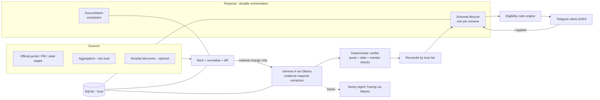

# 🛡️ Scheme Sentinel

**A durable, local-first, open-model agent that watches Indian scholarship sources for one real student, so he never misses a deadline, a document, or a verification stage.**

*This is a submission for the [Hacktoberfest Weekend Challenge: Build for a Friend](https://dev.to/challenges/hacktoberfest-weekend-2026-10-01)*

`#devchallenge` `#weekendchallenge` `#hf26challenge` `#hacktoberfest`

> ⚠️ **Independent student project. Not affiliated with or endorsed by any government body.** Dates and eligibility information may be wrong or out of date. **Always verify on the official portal** (e.g. [scholarships.gov.in](https://scholarships.gov.in)) before acting.

<!-- TODO(after-build): add a hero GIF/screenshot of the Telegram alert + dashboard here (use the synthetic profile). -->

---

## What I Built

<!-- TODO(after-build): rewrite this in your own voice. This is the heart of the post. Keep the story, replace the placeholders. -->

**Scheme Sentinel** is an always-on assistant I built for my friend **[[FRIEND_NAME]]**, a **[[COURSE]]** student in **[[STATE]]**. `[[One or two sentences: what he was struggling with. e.g. "He kept finding out about scholarship deadlines from WhatsApp forwards, a day or two before they closed."]]`

The problem isn't finding a list of schemes. It's that:

- scholarship information is scattered across portals, PDFs, notices, and aggregator sites that often disagree;
- deadlines get extended or revised;
- applying is only the first step: many schemes also have **institute verification** and **state verification** stages with their own deadlines;
- a missing or inconsistent certificate can cost a whole year.

What it does for him:

| | |
|---|---|
| 👀 **Watches** | A hand-picked set of official sources (and a few low-trust aggregators) for changes |
| ✅ **Matches** | Schemes against his profile with a **tri-state** verdict: eligible / not eligible / *unknown* (with the missing field named) |
| ⏰ **Reminds** | At T-30/14/7/3/1 days, in English or Hindi, on Telegram |
| 🔁 **Tracks the full lifecycle** | Discovered → eligible → docs ready → applied → institute verified → state verified → disbursed |
| 📄 **Checks documents** | What each scheme needs vs. what he has, and what's expiring |
| ⚖️ **Flags conflicts** | When two sources disagree, it says so and points to the official one |
| 🧾 **Shows its evidence** | **No source, no alert**: every message carries the link and the exact sentence it came from |

It never logs into a portal, never submits anything, and never stores Aadhaar or bank numbers. **A human applies; the agent makes sure he knows when, and with what.**

> **Friend's reaction:** <!-- TODO(after-build): "…" (with permission). This is the bonus-points part, so make it real. -->

---

## Demo

<!-- TODO(after-build): replace with real links -->

- 🎥 **Video demo:** `[[VIDEO_URL]]`
- 🖥️ **Dashboard screenshots:** `[[SCREENSHOT_LINKS]]`
- 📱 **Telegram alert example:** `[[SCREENSHOT]]`
- ⏱️ **Temporal event history (kill-and-resume):** `[[SCREENSHOT]]`

**What's live vs. simulated** (be explicit):

| Demo segment | Live or simulated? |
|---|---|
| Source polling against real pages | `[[LIVE / FIXTURE]]` |
| "Deadline extended" alert | `[[SIMULATED via before/after fixture / LIVE]]` |
| Worker kill and resume | Live |
| Friend's usage | `[[describe]]` |

---

## Code

<!-- TODO(after-build): embed the repo with the DEV GitHub embed tag:  -->

Repo: `[[GITHUB_REPO_URL]]`

---

## How I Built It

### Architecture



### The open-source pieces

| Piece | Role |
|---|---|
| **Gemma 4** (open-weight) via **Ollama** | Local reading of scheme pages (and certificate photos in the optional image check). Runs on a laptop; no data leaves the machine |
| **Mastra** (open-source TypeScript agent framework) | Agent and typed-tool definitions; tracing export |
| **Temporal** (open-source durable execution) | Long-running per-scheme workflows, durable reminder timers, retries, signals |
| **SQLite** | Local persistence |
| **Hono, zod, cheerio, vitest** | API, schemas, parsing, tests |

### The idea that makes it more than a wrapper

The model **never decides** anything on its own:

1. **Evidence-required extraction.** For every fact the model proposes, it must copy the exact supporting sentence from the page.
2. **Deterministic verification.** Code checks that the quote really exists in the page, re-parses the date from the quote itself (day-first Indian formats), and checks numbers and plausibility. Facts that fail are dropped and counted.
3. **Rules, not vibes.** Eligibility is a pure, unit-tested function with three outcomes. Unknown stays unknown.
4. **Cheap first.** Pages are hashed and diffed; the model runs only when a *material* change is detected.
5. **Official beats aggregator.** Trust tiers resolve conflicts, and conflicts are shown to the student.

### Results

<!-- TODO(after-build): paste tables from eval/results/*.md. Do not leave placeholder numbers in the final post. -->

| Metric | Gemma 4 `[[tag]]` | `[[second open model]]` |
|---|---|---|
| Deadline exact-match | `[[ ]]` | `[[ ]]` |
| Criteria F1 | `[[ ]]` | `[[ ]]` |
| Hallucinated facts proposed | `[[ ]]` % | `[[ ]]` % |
| …of which caught by the verifier | `[[ ]]` % | `[[ ]]` % |
| Latency p50 / p95 per page | `[[ ]]` | `[[ ]]` |
| Cost | ₹0 | ₹0 |

| Efficiency | Value |
|---|---|
| Source checks run | `[[ ]]` |
| Skipped by diff (no LLM call) | `[[ ]]` % |
| Alerts sent / with an official source | `[[ ]]` / `[[ ]]` |

**Durability test:** `[[Killed the worker mid-timer; on restart the workflow resumed and each reminder fired exactly once.]]`

**A bug the trace caught:** `[[Short story: what went wrong, which span showed it, how you fixed it.]]`

---

## Why Does Open Innovation Matter?

<!-- TODO(after-build): keep only claims your numbers support. Say where closed models did better, if they did. -->

- **His data stays his.** A student's category, family income, marks, and certificates are exactly the data you don't want on someone else's server. With an open-weight model running locally, the profile and documents never leave his laptop.
- **It costs ₹0 to run, and keeps running.** No per-call API bills for a tool that polls all month.
- **Control and auditability.** I could pin the model, fix the seed, version the prompts, constrain the output schema, and measure exactly how often it was wrong, then build a verifier around it. `[[Add what swapping models taught you.]]`
- **It works where the internet doesn't.** `[[Optional: describe an offline test, if you did one.]]`
- **Honest trade-off:** `[[Where a larger/closed model was better, and why open still made sense here.]]`

---

## My Agent Session

<!-- TODO(after-build): save your session with DevRelay and embed it with the agent_session tag per the challenge page, or link it. Link Entire sessions too. -->

- DevRelay: `[[SESSION_LINK]]`
- Entire: `[[SESSION_LINKS]]`
- One example of using past sessions to explain why code exists: `[[short note]]`

---

## Prize Categories

<!-- TODO(after-build): delete any category you did not genuinely use. -->

- **Best Use of Gemma**: Gemma 4 does all extraction locally `[[and certificate image checks]]`.
- **Best Use of Temporal**: per-scheme lifecycle workflows with durable timers, signals, retries, and a kill-and-resume demo.
- **Best Use of Mastra**: extraction agent with typed tools and tracing export.
- **Best Use of Sentry Agent Tracing**: traces with latency, tokens, and tool spans, plus a real debugging story.
- **Best Use of Entire**: agent sessions behind the build are shared in this write-up.
- `[[Best Use of SerpApi: discovery workflow (if built)]]`
- `[[Best Use of Backboard: open-model comparison (if used)]]`
- `[[Best Use of GitHub Copilot: only if you used it]]`

---

# Using the repository

## Features

- Evidence-required, schema-constrained extraction with a deterministic verifier
- Tri-state eligibility engine with per-criterion reasons and evidence
- Source registry with trust tiers, polite fetching, snapshotting, and material-change diffing
- Reconciliation of conflicting sources
- Temporal workflows: scheduled source watching and long-running per-scheme lifecycle tracking
- Durable reminders at T-30/14/7/3/1 days (09:00 IST), re-planned automatically when deadlines change
- Telegram bot (EN/HI) with commands and inline buttons
- Document checklist, with optional local image checks
- Dashboard and API; metrics; reproducible evals; demo scripts

## Prerequisites

- **Node.js 22.13+** and **pnpm**
- **[Ollama](https://ollama.com)** with a Gemma 4 model pulled (`[[model tag]]`; `ollama pull [[tag]]`)
- **[Temporal CLI](https://docs.temporal.io/cli)** (for the local dev server)
- A **Telegram bot token** from [@BotFather](https://t.me/BotFather)
- Optional: a Sentry project DSN (for agent tracing); a SerpApi key (discovery)

Rough hardware: `[[RAM / CPU / GPU you used and the model's observed speed]]`.

## Quick start

```bash
git clone [[GITHUB_REPO_URL]] && cd scheme-sentinel
pnpm install

cp .env.example .env                       # fill in values (see Configuration)
cp data/profile.example.yaml data/profile.yaml   # edit; this file is gitignored

# 1) local services (separate terminals)
ollama serve
temporal server start-dev                  # UI: http://localhost:8233

# 2) initialise
pnpm seed                                  # loads scheme registry + profile into SQLite
pnpm schedules:create                      # per-source Temporal schedules

# 3) run
pnpm dev:worker                            # Temporal worker
pnpm dev:api                               # dashboard + API: http://localhost:8787
pnpm dev:bot                               # Telegram bot (long polling)
```

### Try it without the network (fixture mode)

```bash
FIXTURE_MODE=1 pnpm demo:replay            # applies a before/after notice pair (SIMULATED)
pnpm demo:kill-resume                      # kills the worker mid-timer and verifies resume
```

## Configuration

Copy `.env.example` to `.env`. Key variables:

| Variable | Purpose |
|---|---|
| `OLLAMA_HOST`, `OLLAMA_MODEL` | Local model endpoint and tag |
| `TEMPORAL_ADDRESS`, `TEMPORAL_TASK_QUEUE` | Temporal connection |
| `TELEGRAM_BOT_TOKEN`, `TELEGRAM_CHAT_ID` | Alerts |
| `SENTRY_DSN`, `SENTRY_TRACES_SAMPLE_RATE` | Agent tracing (rate must be > 0) |
| `TRACE_CAPTURE_IO` | `0` keeps prompts/outputs out of traces (use for the real profile) |
| `FIXTURE_MODE` | `1` reads saved pages instead of the network |
| `USER_AGENT` | Identifies the bot to websites (add a contact email) |

Data files you edit: `data/sources.yaml` (what to watch + trust tiers), `data/schemes.seed.yaml` (hand-verified scheme registry), `data/profile.yaml` (the student; **never commit**).

## Evaluation

```bash
pnpm test            # unit + workflow tests (rules, diff, verifier, reminders, Temporal)
pnpm eval            # runs the gold set across configured models
pnpm report          # writes eval/results/<timestamp>.md with tables for the post
```

Gold-set pages live in `data/gold/` (hand-labelled). Results are reproducible with one command.

## Project structure

```
src/
  rules/        eligibility, deadlines, reminder planning (pure, tested)
  sources/      fetch, normalise, diff, reconcile
  llm/          Ollama client, prompts, extraction, verifier
  agent/        Mastra agents, tools, tracing
  temporal/     workflows, activities, worker, schedules
  notify/       Telegram bot + templates
  documents/    checklist + optional image checks
  store/        SQLite schema + repositories
  api/          Hono routes
  eval/         runner, scorers, report
public/         static dashboard
data/           sources, registry, fixtures, gold set
scripts/        seed, demos, report
```

Full technical details: see [`Project-Details.md`](./Project-Details.md).

## Privacy and safety

- **Local-first.** Profile, documents, and database stay on the machine. The model runs locally.
- **Data minimisation.** No Aadhaar numbers, bank account numbers, passwords, or OTPs are stored.
- **No portal automation.** The agent doesn't log in, bypass captchas/OTP/face authentication, or submit forms.
- **Polite scraping.** robots.txt is honoured; polling is hours-scale; the user-agent identifies the project.
- **Safe failure.** If it isn't sure, it says `UNKNOWN`, shows the source, and sends you to the official page.
- **Public artefacts use a synthetic profile.** Screenshots, traces, and demo data in this repo are synthetic.

## Limitations

- Covers a **small, hand-seeded set** of schemes for one student; it is not a national scholarship search engine.
- Government pages can be slow, JavaScript-heavy, or restrict bots; some sources may need manual fixtures.
- Small local models make mistakes; the verifier reduces but does not eliminate wrong facts. Treat every date as "verify first."
- Hindi templates are hand-written and reviewed by `[[reviewer]]`; regional languages beyond Hindi are not covered.
- Scanned (image-only) PDFs aren't parsed.

## Roadmap

- More states and schemes; a community-maintained registry format
- Voice-note reminders; WhatsApp channel (when a free path exists)
- Regional-language templates and a fine-tuned extraction model with before/after evals
- Shareable "family mode" for parents

## Acknowledgements

Thanks to `[[the friend]]` for trusting me with his real deadlines, to the Hacktoberfest 2026 organizers (MLH, DEV, DigitalOcean), and to the open-source projects this stands on: Gemma, Ollama, Mastra, Temporal, SQLite, and the rest.
`[[Team credits: list DEV usernames of teammates, if any.]]`

## Licence

`[[Choose a licence, e.g. MIT, and add LICENSE.]]` Model use is subject to the Gemma terms. Check dependency and fixture licences before publishing.

---

<!-- Pre-publish checklist (delete before posting):
[ ] All [[PLACEHOLDERS]] and TODO(after-build) comments resolved
[ ] Numbers copied from eval/results, not estimated
[ ] Live vs simulated clearly labelled
[ ] Friend's consent obtained; sensitive details anonymised
[ ] No secrets, profile.yaml, DB, or private documents committed
[ ] Unused prize categories removed
[ ] DEV post tags: devchallenge, weekendchallenge, hf26challenge
[ ] Submitted before Mon 5 Oct 2026, 12:29 PM IST
-->
